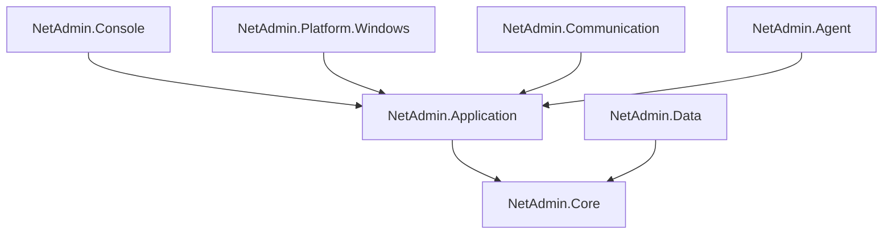
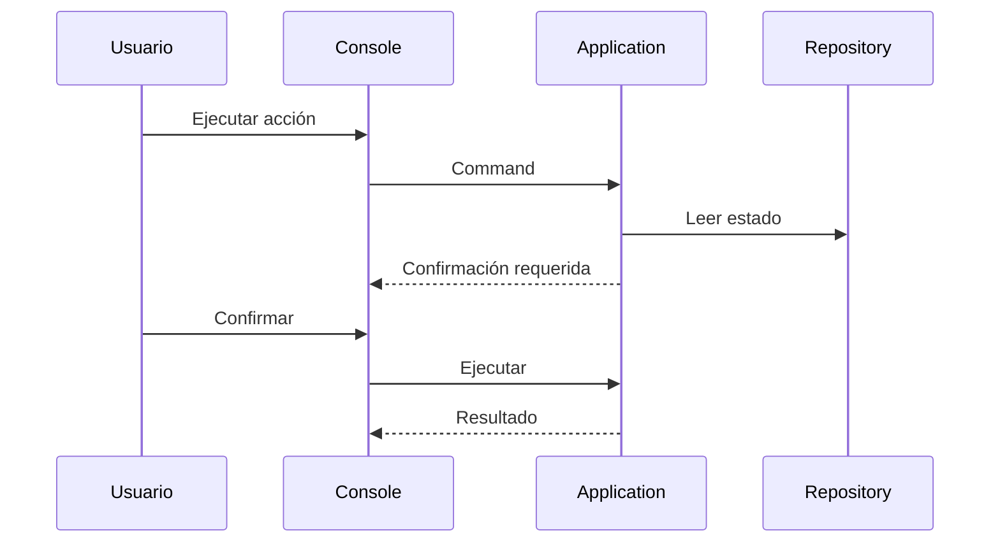

# Diagramas de Arquitectura

## Capas

```mermaid
flowchart TD
    UI[NetAdmin.Console] --> APP[NetAdmin.Application]
    APP --> CORE[NetAdmin.Core]
    DATA[NetAdmin.Data] --> CORE
    WIN[NetAdmin.Platform.Windows] --> APP
    COMM[NetAdmin.Communication] --> APP
    AGENT[NetAdmin.Agent] --> APP
```

## Flujo de acción

```mermaid
sequenceDiagram
    participant U as Usuario
    participant C as Console
    participant A as Application
    participant R as Repository
    U->>C: Ejecutar acción
    C->>A: Command
    A->>R: Leer estado
    A-->>C: Confirmación requerida
    U->>C: Confirmar
    C->>A: Ejecutar
    A-->>C: Resultado
```
