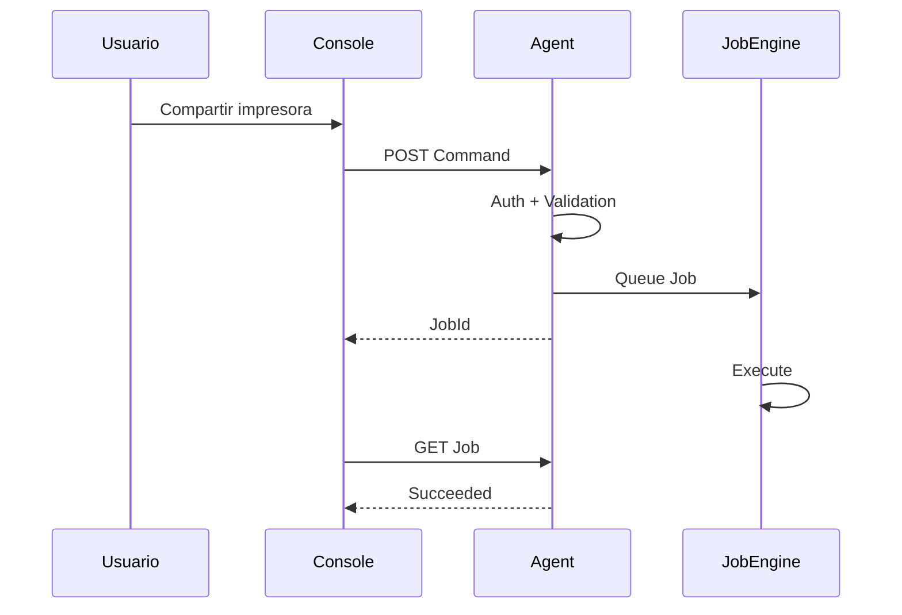

# Diagrama de Comando

```mermaid
sequenceDiagram
    participant U as Usuario
    participant C as Console
    participant A as Agent
    participant J as JobEngine
    U->>C: Compartir impresora
    C->>A: POST Command
    A->>A: Auth + Validation
    A->>J: Queue Job
    A-->>C: JobId
    J->>J: Execute
    C->>A: GET Job
    A-->>C: Succeeded
```
