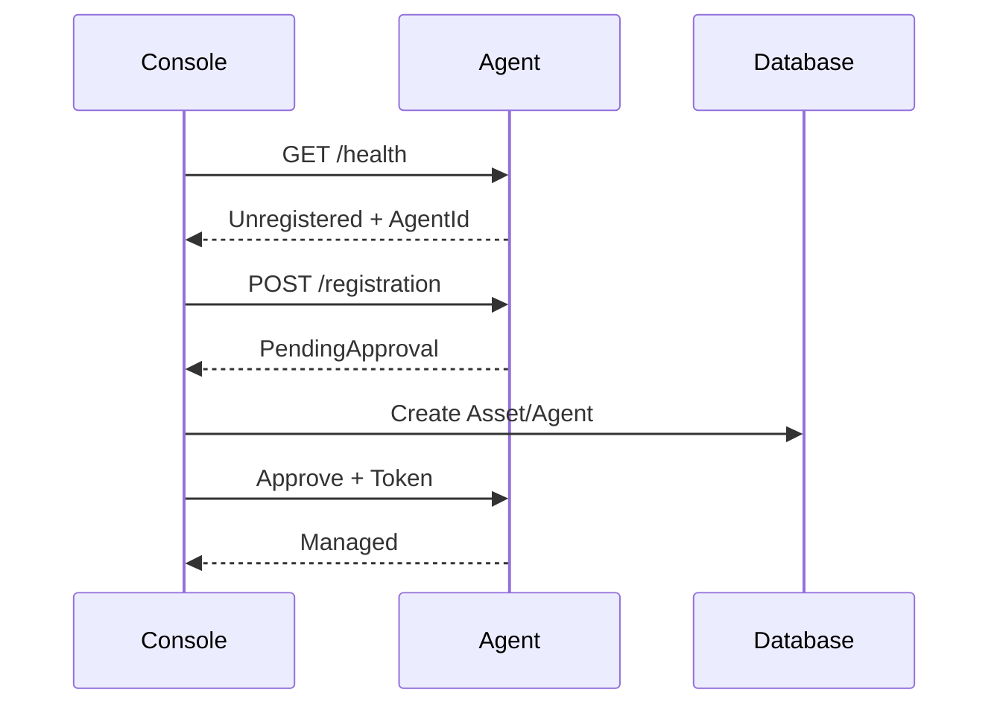

# Diagrama de Registro

```mermaid
sequenceDiagram
    participant C as Console
    participant A as Agent
    participant D as Database
    C->>A: GET /health
    A-->>C: Unregistered + AgentId
    C->>A: POST /registration
    A-->>C: PendingApproval
    C->>D: Create Asset/Agent
    C->>A: Approve + Token
    A-->>C: Managed
```
